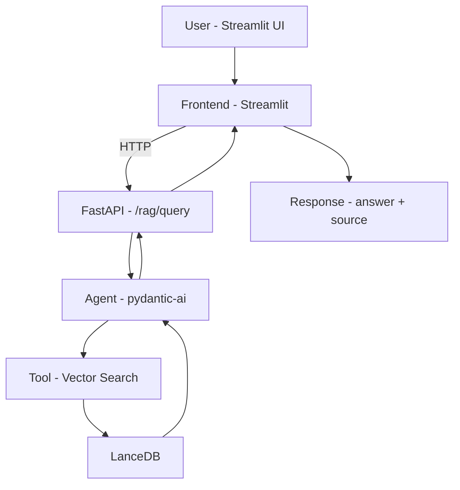

## 🧩 Project Structure Notes

This project uses a shared Python environment with a modular workspace setup:

- One `.venv` for the entire project
- One root `pyproject.toml`
- Separate `pyproject.toml` files for:
  - backend
  - frontend

### Why this structure?

- Prepares the project for Dockerization into two services:
  - backend
  - frontend
- Each service can independently run:

  uv sync

- Allows separation of dependencies:
  - some packages are only needed in the backend
  - others are only needed in the frontend

This setup follows a monorepo-style architecture and supports scalable deployment.

This setup avoids unnecessary dependencies in each service and simplifies future containerization.

# 📚 RAG Demo – Multilingual Animal Q&A System

This project is a simple end-to-end Retrieval-Augmented Generation (RAG) system that answers questions about animals using a custom knowledge base built from Swedish Wikipedia-style text.

It demonstrates how to combine:
- vector databases (LanceDB)
- embeddings
- LLM agents
- FastAPI (backend)
- Streamlit (frontend)

---

## 🚀 Features

- Ingest `.txt` documents into a vector database
- Multilingual support (Swedish data + queries)
- Semantic search using embeddings
- LLM-powered answers with source attribution
- FastAPI backend for RAG queries
- Streamlit frontend for interaction
- Notebook for data exploration and validation

---

## 🧠 Architecture



## 📂 Project Structure

```
RAG-DEMO/
├── .gitignore
├── README.md
│
├── rag/
│   ├── .venv/
│   ├── .python-version
│   ├── pyproject.toml
│   ├── uv.lock
│   │
│   ├── src/
│   │   └── rag/
│   │       ├── backend/
│   │       │   ├── agents.py
│   │       │   ├── api.py
│   │       │   ├── constants.py
│   │       │   ├── data_models.py
│   │       │   └── pyproject.toml
│   │       │
│   │       ├── frontend/
│   │       │   ├── app.py
│   │       │   └── pyproject.toml
│   │       │
│   │       ├── setup/
│   │       │   └── ingestion.py
│   │       │
│   │       ├── data/
│   │       │   ├── fisk.txt
│   │       │   ├── kanin.txt
│   │       │   ├── krabba.txt
│   │       │   ├── panda.txt
│   │       │   └── tiger.txt
│   │       │
│   │       ├── knowledge_base/
│   │       │   └── articles.lance/
│   │       │       ├── data/
│   │       │       ├── _transactions/
│   │       │       └── _versions/
│   │       │
│   │       └── explorations/
│   │           └── explore_knowledge_base.ipynb
```
---

## ⚙️ Tech Stack

- LanceDB – vector database
- pydantic-ai – agent framework
- Cohere embeddings – vector representations
- FastAPI – backend API
- Streamlit – frontend UI
- uv – dependency & workspace management

---

## 🔐 Environment Variables

This project uses a `.env` file to manage API keys.

Create a `.env` file in the root directory and add:

COHERE_API_KEY=your_cohere_key
OPENROUTER_API_KEY=your_openrouter_key
GEMINI_API_KEY=your_gemini_key

These are used for:
- Cohere → embeddings
- OpenRouter / Gemini → LLM responses

⚠️ Do not commit your `.env` file to version control.

---

## 📦 Project Setup

This project uses a src-based layout with a uv workspace, separating backend and frontend into modular packages.

Install dependencies:

uv sync

---

## 📥 Data Ingestion

To build the knowledge base:

uv run python src/rag/setup/ingestion.py

This will:
- read `.txt` files from `data/`
- generate embeddings automatically via LanceDB + Cohere
- store them in the `articles` table

---

## 🔍 Exploring the Knowledge Base

Use the notebook:

explorations/explore_knowledge_base.ipynb

You can:
- inspect stored documents
- verify embeddings
- test semantic search
---

## 🧪 Run the Backend

uv run uvicorn rag.backend.api:app --reload

{
  "prompt": "Vad äter pandor?"
}

---

## 🎨 Run the Frontend

uv run streamlit run src/rag/frontend/app.py

Then open:
http://localhost:8501

---

## 🧠 How It Works

1. Documents are ingested into LanceDB
2. Text is embedded using Cohere embeddings
3. User asks a question via Streamlit
4. FastAPI sends it to the agent
5. Agent retrieves relevant document via vector search
6. LLM generates an answer
7. Source file is returned

---

## 🌍 Multilingual Capability

The system uses Swedish documents and supports Swedish queries, demonstrating:

- multilingual embeddings
- semantic search across languages

---

## 🔮 Future Improvements

- Text chunking (better retrieval granularity)
- Dockerization (separate frontend/backend services)
- Deployment to cloud
- Logging & monitoring (MLOps practices)
- Batch ingestion pipeline

---

## 💡 Final Thoughts

This project demonstrates a modular RAG system with:
- clear separation of backend and frontend
- working vector search and embeddings
- reproducible ingestion pipeline

It serves as a strong foundation for building production-ready RAG and MLOps systems.